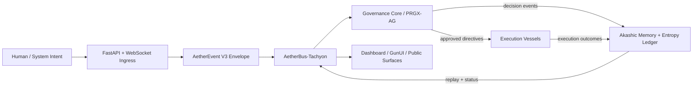

# AETHERIUM GENESIS (AG-OS)
### Unified AI-OS Platform / แพลตฟอร์ม AI-OS แบบบูรณาการ


> AETHERIUM-GENESIS is a governed AI operating layer that connects human intent, AI reasoning, policy validation, execution, memory continuity, and manifestation.

---

## 📖 Platform Overview / ภาพรวมแพลตฟอร์ม

AETHERIUM-GENESIS is not a demo-first interface or a thin LLM wrapper. It is an AI-OS platform designed to keep cognition, governance, execution, memory, and manifestation structurally aligned.

AETHERIUM-GENESIS ไม่ใช่เดโมหน้าเว็บหรือเพียงตัวห่อหุ้ม LLM แต่เป็นแพลตฟอร์ม AI-OS ที่จัดวางการรู้คิด การกำกับดูแล การปฏิบัติการ หน่วยความจำ และการแสดงผลให้เชื่อมกันอย่างมีโครงสร้าง

### Canonical subsystem map / แผนผังองค์ประกอบหลัก

- **Mind — Logenesis**: intent interpretation, reasoning, planning.
- **Kernel — Governance Core / PRGX-AG**: policy validation, risk controls, approval gates.
- **Bus — AetherBus-Tachyon**: canonical transport and correlation propagation.
- **Hands — Vessels**: execution adapters into workspaces, services, and external systems.
- **Memory — Akashic fabric**: append-only continuity, replay joins, and ledger persistence.
- **Body — GunUI / Dashboard / PWA**: render-only manifestation surfaces driven by backend directives.

- **Mind — Logenesis**: แปลความ intent และวางแผนการทำงาน
- **Kernel — Governance Core / PRGX-AG**: บังคับใช้นโยบาย จัดระดับความเสี่ยง และควบคุมการอนุมัติ
- **Bus — AetherBus-Tachyon**: โครงข่ายสื่อสารหลักพร้อมการส่งต่อ correlation
- **Hands — Vessels**: ตัวเชื่อมสำหรับลงมือปฏิบัติในระบบภายนอก
- **Memory — Akashic fabric**: บันทึกต่อเนื่องแบบ append-only รองรับ replay และ audit
- **Body — GunUI / Dashboard / PWA**: ชั้นแสดงผลที่สะท้อนสถานะจาก backend เท่านั้น

---

## 🧠 Canonical Control Loop / วงจรควบคุมหลัก

`Intent -> Reasoning -> Policy Validation -> Execution -> Memory Commit -> Manifestation`

### Runtime guarantees / หลักประกันของระบบ

- **Envelope-first communication** via the V3 `AetherEvent` schema.
- **Governance-first execution** for destructive or high-impact actions.
- **Memory continuity** with causal chains and replay-ready ledger records.
- **Render-only manifestation** so frontend surfaces never become the semantic source of truth.

- **สื่อสารด้วย envelope เป็นหลัก** ผ่านสคีมา V3 `AetherEvent`
- **Governance มาก่อน execution** สำหรับงานที่มีผลกระทบสูงหรือย้อนกลับไม่ได้
- **หน่วยความจำต่อเนื่อง** ผ่าน causal chain และ ledger ที่ replay ได้
- **Frontend เป็นเพียงชั้นแสดงผล** ไม่ใช่ผู้กำหนดความหมายของระบบ

---

## 🏗️ System Architecture Diagram / แผนภาพสถาปัตยกรรมระบบ

The diagram below reflects the current codebase organization in `src/backend/main.py`, `src/backend/routers/aetherium.py`, `src/backend/governance/runtime.py`, `src/backend/genesis_core/entropy/ledger.py`, and the frontend manifestation routes.

แผนภาพด้านล่างสะท้อนโครงสร้างจากโค้ดปัจจุบันของ `src/backend/main.py`, `src/backend/routers/aetherium.py`, `src/backend/governance/runtime.py`, `src/backend/genesis_core/entropy/ledger.py` และเส้นทางการแสดงผลฝั่ง frontend



---

## 🗂️ Repository Layout / โครงสร้างรีโพซิทอรี

- `src/backend/` — runtime, governance, buses, memory, vessels, and API routes.
- `src/frontend/` — homepage, dashboard, GunUI surfaces, and public client assets.
- `docs/` — canonical technical specifications, audits, roadmaps, and integration references.
- `tests/` — regression coverage for governance, protocol, UI, memory, and vessel contracts.

- `src/backend/` — runtime, governance, bus, memory, vessels และ API routes
- `src/frontend/` — หน้าแรก Dashboard GunUI และ static assets ฝั่ง client
- `docs/` — เอกสารสถาปัตยกรรม สเปก การตรวจสอบ และ roadmap
- `tests/` — ชุดทดสอบ regression สำหรับ governance, protocol, UI, memory และ vessel contracts

---

## 🚀 Run the Platform / การรันระบบ

### 1. Install dependencies

```bash
pip install -r requirements.txt
```

Optional visual / ML extensions:

```bash
pip install -r requirements/optional-ml-visual.txt
```

Development and test tooling:

```bash
pip install -r requirements/dev.txt
```

### 2. Configure runtime

```bash
export PYTHONPATH=$PYTHONPATH:.
export BUS_IMPLEMENTATION=tachyon
export BUS_INTERNAL_ENDPOINT=tcp://127.0.0.1:5555
export BUS_EXTERNAL_ENDPOINT=ws://127.0.0.1:5556/ws
export BUS_CODEC=msgpack
export BUS_COMPRESSION=none
export BUS_TIMEOUT_MS=2000
```

### 3. Start the system

```bash
python awaken.py
```

or

```bash
python -m uvicorn src.backend.main:app --host 0.0.0.0 --port 8000
```

### 4. Core access points

- Product homepage: `http://localhost:8000`
- Operations dashboard: `http://localhost:8000/dashboard`
- API docs: `http://localhost:8000/docs`
- Public gateway: `http://localhost:8000/public`

---

## ✅ Recommended validation / ชุดตรวจสอบที่แนะนำ

```bash
pytest -q tests/test_aetherium_api.py tests/test_integration_ui.py tests/test_frontend_homepage.py
```

---

## 🔭 New function proposals / ข้อเสนอฟังก์ชันและแนวทางต่อยอดใหม่

### English

- **Replay Console**: operator timeline that reconstructs governance decisions and execution results from Akashic records.
- **Directive Diff Inspector**: compare planned directives, approved directives, and executed outcomes side by side.
- **Governance Policy Simulator**: sandbox interface for testing policy packs against recorded intent streams.
- **Cross-Vessel Execution Ledger**: normalized execution timeline across workspace, storage, messaging, and external tools.
- **Manifestation Fidelity Monitor**: checks whether frontend surfaces remain consistent with backend directive envelopes.

### ภาษาไทย

- **Replay Console**: หน้าจอไล่เหตุการณ์ย้อนหลังจาก Akashic records เพื่อดู intent การอนุมัติ และผลการปฏิบัติการ
- **Directive Diff Inspector**: เปรียบเทียบแผน คำสั่งที่ได้รับอนุมัติ และผลลัพธ์จริงแบบเคียงข้างกัน
- **Governance Policy Simulator**: โหมดจำลองสำหรับทดสอบ policy packs กับกระแส intent ที่บันทึกไว้
- **Cross-Vessel Execution Ledger**: ไทม์ไลน์รวมการปฏิบัติการจาก workspace, storage, messaging และเครื่องมือภายนอก
- **Manifestation Fidelity Monitor**: เครื่องมือตรวจสอบว่า frontend ยังสะท้อน directive envelopes จาก backend อย่างถูกต้อง

---

## 📚 Core documents / เอกสารหลัก

- [docs/CANONICAL_TECHNICAL_SPEC.md](docs/CANONICAL_TECHNICAL_SPEC.md)
- [docs/directive_envelope_standard.md](docs/directive_envelope_standard.md)
- [docs/UNIFIED_AI_OS_INTEGRATION.md](docs/UNIFIED_AI_OS_INTEGRATION.md)
- [docs/AETHERBUS_TACHYON_INTEGRATION.md](docs/AETHERBUS_TACHYON_INTEGRATION.md)
- [docs/ARCHITECTURE_AUDIT.md](docs/ARCHITECTURE_AUDIT.md)

© 2026 Aetherium Syndicate Inspectra (ASI)
