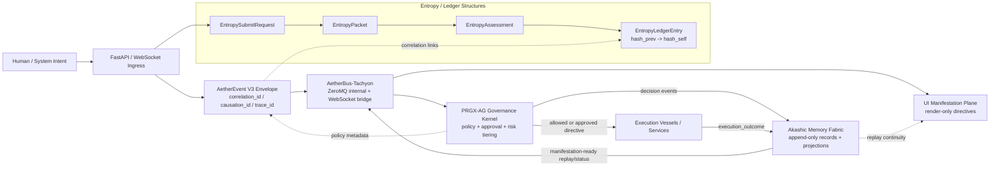

# AETHERIUM GENESIS (AG-OS)
### Unified AI-OS Platform / แพลตฟอร์ม AI-OS แบบบูรณาการ


> AETHERIUM-GENESIS is evolving toward a governed AI operating system where intent, reasoning, governance, execution, memory, and manifestation stay structurally aligned.

---

## 📖 Current State / สถานะปัจจุบัน

AETHERIUM-GENESIS now documents a **Unified AI-OS** runtime posture rather than a demo-first interface project.

### Canonical subsystem map

- **Mind — Logenesis / orchestration**: interprets intent and prepares directives.
- **Kernel — PRGX-AG governance source**: policy evaluation, approval, and risk gating.
- **Bus — AetherBus-Tachyon**: canonical ZeroMQ internal transport + WebSocket bridge.
- **Hands — Vessels / adapters**: execution surfaces that must honor governance outcomes.
- **Memory — Akashic fabric**: append-only continuity records and replay-linked ledger history.
- **Body — UI / PWA**: manifestation surfaces that render backend-authored directives only.

### Repository layout

- `src/backend/` — runtime orchestration, governance hooks, bus integrations, memory, and vessels.
- `src/frontend/` — manifestation surfaces, dashboard routes, and render-only client assets.
- `docs/` — architecture, protocol, migration, and integration reference.
- `tests/` — protocol, governance, bus, memory, and UI verification.

---

## 🧠 Unified AI-OS Architecture

### Canonical control loop

`Intent -> Reasoning -> Policy Validation -> Execution -> Memory Commit -> Manifestation`

### Runtime roles

| Layer | Canonical component | Responsibility |
| --- | --- | --- |
| System bus | **AetherBus-Tachyon** | V3 envelope transport, correlation propagation, bridge fan-out |
| Governance kernel source | **PRGX-AG** | Policy evaluation, approval gates, risk-tiered control |
| Memory fabric | **Akashic** | Immutable continuity records, replay joins, ledger persistence |
| Manifestation plane | **UI / PWA** | Render backend directives, diagnostics, and replay surfaces |

### System Architecture Diagram (Data + Control Flow)

The diagram below reflects the current runtime structures in `src/backend/genesis_core/protocol/schemas.py`, `src/backend/genesis_core/entropy/schemas.py`, and `src/backend/genesis_core/entropy/ledger.py`.



### Canonical runtime guarantees

- **Envelope-first traffic**: all cross-subsystem messages use the V3 `AetherEvent` envelope.
- **Correlation continuity**: `correlation_id`, `causation_id`, and `trace_id` are created at origin and preserved end-to-end.
- **Governance-first execution**: no execution-capable path should bypass policy and approval rules.
- **Memory continuity**: governed outcomes must commit to canonical memory records before they become final state.
- **Render-only frontend**: the UI may render directives, status, diagnostics, and replay metadata, but must not invent semantic truth.

---

## 🚌 Phase 1 Integration Status

Phase 1 remains focused on bus and protocol alignment.

### Current state

- `BusFactory` defaults to **Tachyon** as the canonical runtime bus.
- Internal service communication is modeled around **ZeroMQ** endpoints.
- External consumers attach through a **WebSocket bridge**.
- The canonical envelope is **`AetherEvent` V3**.
- Legacy bus implementations remain available only as compatibility shims.

### Migration phases

1. **Phase 1 — Canonical bus path**
   - Tachyon adapter/client as preferred runtime path.
   - V3 envelope enforcement.
   - Correlation propagation across publish/subscribe and manifestation fan-out.
   - Config-driven endpoint selection.
2. **Phase 2 — Governance bridge expansion**
   - Route PRGX-AG approval outcomes into canonical envelopes.
   - Strengthen governed execution readiness contracts.
3. **Phase 3 — Memory projections and replay tooling**
   - Derived read models, replay console, audit/export surfaces.
4. **Phase 4 — Full cross-repo operationalization**
   - Contract harnesses, deployment profiles, and rollback drills across the three repositories.

### Next proposals / ข้อเสนอถัดไป

#### 🇹🇭 ข้อเสนอฟังก์ชัน/แนวทางต่อยอดใหม่
- **Cross-Repo Contract Harness**: เพิ่มชุดตรวจสอบ protocol/approval/memory continuity ระหว่าง AETHERIUM-GENESIS, PRGX-AG, และ AetherBus-Tachyon
- **Governed Replay Console**: สร้าง console สำหรับไล่เหตุการณ์ตาม `correlation_id` พร้อม timeline ของ governance, execution, และ ledger continuity
- **Deployment Profiles**: เพิ่ม profile สำหรับ local / staging / production เพื่อกำหนด endpoint, codec, และ bridge policy ให้ตรงกันทั้ง 3 repositories
- **Directive Catalog**: จัดทำ catalog ของ backend-authored manifestation directives เพื่อให้ frontend render ได้สม่ำเสมอและตรวจสอบสัญญาได้ง่าย
- **Projection Workers**: แยก worker สำหรับสร้าง derived views จาก canonical stream โดยไม่แตะ append-only source of truth
- **Approval Outcome Bridge**: แปลงผลการอนุมัติจาก PRGX-AG เป็น V3 envelopes ที่พร้อมใช้งานทั้งด้าน memory และ manifestation

#### 🇬🇧 Proposed Next Functions / Extensions
- **Cross-Repo Contract Harness**: add protocol, approval, and memory continuity checks across AETHERIUM-GENESIS, PRGX-AG, and AetherBus-Tachyon.
- **Governed Replay Console**: build an operator surface that reconstructs one `correlation_id` lifecycle across governance, execution, and ledger continuity.
- **Deployment Profiles**: define local, staging, and production endpoint/codec/bridge profiles shared by all three repositories.
- **Directive Catalog**: formalize backend-authored manifestation directive shapes for stable frontend rendering.
- **Projection Workers**: derive operator/search read models from the canonical stream without mutating the append-only source of truth.
- **Approval Outcome Bridge**: convert PRGX-AG approval outcomes into V3 envelopes that are ready for memory commit and manifestation.

---

## 📦 Dependency Installation Strategy

The repository now separates dependency roles more explicitly.

### Runtime only
```bash
pip install -r requirements.txt
```

### Optional ML / visual capabilities
```bash
pip install -r requirements/optional-ml-visual.txt
```

### Development + tests
```bash
pip install -r requirements/dev.txt
```

Dependency rationale and import-graph mapping live in [`docs/dependency_inventory.md`](docs/dependency_inventory.md).

---

## 🚀 Running the System

### 1. Environment setup
```bash
export PYTHONPATH=$PYTHONPATH:.
export BUS_IMPLEMENTATION=tachyon
export BUS_INTERNAL_ENDPOINT=tcp://127.0.0.1:5555
export BUS_EXTERNAL_ENDPOINT=ws://127.0.0.1:5556/ws
export BUS_CODEC=msgpack
export BUS_COMPRESSION=none
export BUS_TIMEOUT_MS=2000
```

### 2. Start the application

**Developer mode**
```bash
python awaken.py
```

**Core runtime mode**
```bash
python -m uvicorn src.backend.main:app --host 0.0.0.0 --port 8000
```

### 3. Quick checks
```bash
pytest -q tests/test_bus_factory_tachyon.py tests/test_protocol_v3_envelope.py
```

Access points:
- **Product UI**: `http://localhost:8000`
- **Developer Dashboard**: `http://localhost:8000/dashboard`
- **API Docs**: `http://localhost:8000/docs`

---

## 🗺️ Core Documents

- [docs/AETHERBUS_TACHYON_INTEGRATION.md](docs/AETHERBUS_TACHYON_INTEGRATION.md) — Tachyon runtime and migration notes.
- [docs/UNIFIED_AI_OS_INTEGRATION.md](docs/UNIFIED_AI_OS_INTEGRATION.md) — cross-repo setup, governance requirements, and memory continuity guarantees.
- [docs/directive_envelope_standard.md](docs/directive_envelope_standard.md) — canonical V3 envelope contract.
- [docs/dependency_inventory.md](docs/dependency_inventory.md) — dependency role separation and import-graph audit.
- [docs/AI_OS_PLATFORM_ROADMAP_TH.md](docs/AI_OS_PLATFORM_ROADMAP_TH.md) — Thai roadmap aligned to the AI-OS platform direction.

---

© 2026 Aetherium Syndicate Inspectra (ASI)
