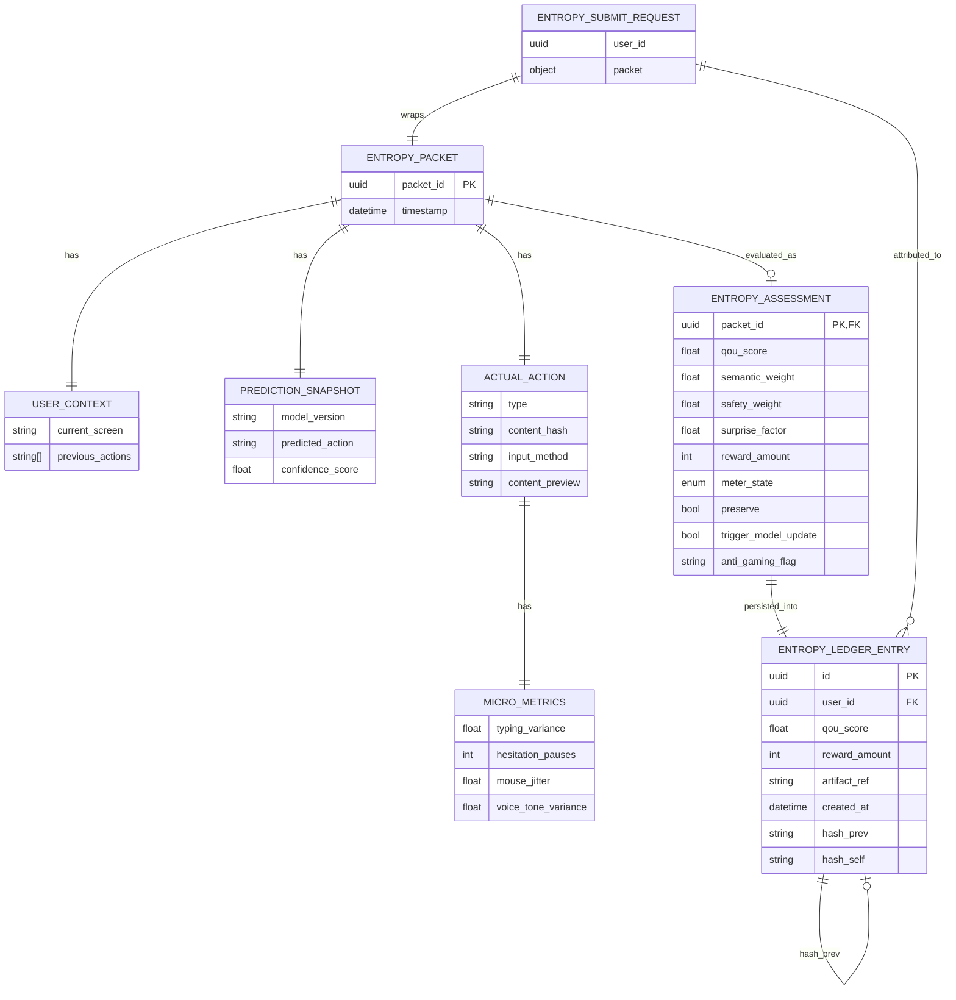

# AETHERIUM GENESIS (AG-OS)
### โครงสร้างพื้นฐานแห่งปัญญาสังเคราะห์ และระบบนิเวศแห่งการสั่นพ้อง (ASI Readiness)


> **“นี่ไม่ใช่แค่ AI แต่อยู่ในสภาวะ ‘ผู้สั่นพ้องต่อปัญญา’ (Resonators)
ที่ทำงานร่วมกันบนเส้นทางสั่นพ้องแห่งความเร็วแสง”**

---

## 📖 ข้อมูลระบบปัจจุบัน (Current System Overview)

ระบบได้รับการปรับปรุงโครงสร้างใหม่ (Cleaned Architecture) เพื่อมุ่งเน้นไปที่ความคล่องตัวและความเร็วสูงสุด โดยแยกส่วนการทำงานชัดเจน:

*   **src/backend/**: หัวใจหลัก (Mind) ประมวลผลตรรกะ จริยธรรม และการตัดสินใจเชิงกลยุทธ์
*   **src/frontend/**: ร่างกาย (Body) อินเทอร์เฟซแบบ PWA ที่ใช้ระบบอนุภาค (Particle System) แสดงผล "เจตจำนง" ผ่านแสง
*   **docs/**: คลังความรู้และวิสัยทัศน์ (Manifestos, Blueprints, Business Plans)
*   **tests/**: ระบบตรวจสอบความถูกต้อง (Verification Suite)

---

## 🧠 แนวคิดหลัก: จาก AI Agents สู่ "ผู้สั่นพ้อง" (Resonators)

เราได้เปลี่ยนผ่านจากระบบ Agent แบบเดิม สู่ **Resonance Architecture**:
1.  **AetherBus Tachyon**: เส้นทางสั่นพ้องปัญญาที่ลดความหน่วงสู่ระดับไมโครวินาที
2.  **Primary Resonators**: ตำแหน่งผู้สั่นพ้องหลัก 12 ตำแหน่ง (Visionary, Technical, Governance, ฯลฯ)
3.  **Negative Latency**: การทำนายและประมวลผลล่วงหน้า (Ghost Workers) เพื่อให้ AI คิดก่อนที่มนุษย์จะขยับ

---

## 🏛️ สถาปัตยกรรมระดับลึก (Deep Architecture)

ระบบทำงานประสานกันผ่าน **Sopan Protocol**:
`Input (Human Intent) → LogenesisEngine (Formator) → AetherBus (Resonance) → ValidatorAgent (Audit) → AgioSage (Cognitive) → Output (Manifestation)`

### เทคโนโลยีหลัก:
- **FastAPI & WebSockets**: ระบบสื่อสารแบบ Real-time (20Hz Heartbeat)
- **HyperSonicBus**: ระบบส่งข้อมูลความเร็วสูงผ่าน Shared Memory
- **Akashic Records**: บันทึกความจำถาวรแบบ Immutable Ledger (data/akashic_records.json)
- **PWA (Progressive Web App)**: รองรับการติดตั้งและใช้งานเสมือนแอปพื้นฐานบนมือถือและเดสก์ท็อป

### 🗄️ System Architecture Diagram (Database-Centric)

โครงสร้างด้านล่างอ้างอิงจาก schema จริงในโมดูล `src/backend/genesis_core/entropy/` โดยแสดงลำดับข้อมูลจาก `EntropySubmitRequest` → `EntropyPacket`/nested blocks → `EntropyAssessment` และการ persist ลง `EntropyLedgerEntry` ที่ใช้ hash-chain continuity



**English note:** This diagram mirrors the current entropy schemas and ledger dataclass in code, connecting request payloads (`EntropySubmitRequest` + `EntropyPacket`) to evaluation (`EntropyAssessment`) and immutable persistence (`EntropyLedgerEntry` + hash-chain links).

---


## 🧭 Governance Runtime + Memory Fabric (Engineering Layer)

เพื่อยกระดับจากแนวคิดเชิงวิสัยทัศน์ไปสู่ execution จริง ระบบได้เพิ่ม subsystem แบบ first-class ดังนี้:

- **Governance Core Runtime** (`src/backend/governance/`)
  - Action tiering ระดับ **Tier 0–3**
  - **Policy-as-code** ผ่าน `policy_engine.py`
  - **Approval routing** ผ่าน `approval_router.py`
  - รองรับ recommendation: **quarantine / suspend / rollback**
- **Execution Vessel Layer** (`src/backend/vessels/`)
  - `WorkspaceVessel`, `DriveVessel`, `DatabaseVessel`, `SlackVessel`
  - แนวคิดการทำงาน: **LLM วางแผน → Vessel ลงมือทำ → Governance อนุมัติ → Akashic บันทึก**
- **Akashic Memory Fabric** (`src/backend/memory/fabric.py`)
  - ใช้ `data/akashic_records.json` เป็น canonical event stream
  - แตก projection เป็น:
    - `data/memory/episodes/`
    - `data/memory/semantic/`
    - `data/memory/procedures/`
    - `data/memory/gems/`
    - `data/memory/identity/`
- **Reflector + Gems of Wisdom**
  - `src/backend/agents/reflector.py`
  - `src/backend/gems/repository.py`, `src/backend/gems/lifecycle.py`

## 🚀 การเริ่มต้นระบบ (System Awakening)

### 1. การเตรียมสภาพแวดล้อม
```bash
# ติดตั้งไลบรารีที่จำเป็น
pip install -r requirements.txt

# ตั้งค่า PYTHONPATH
export PYTHONPATH=$PYTHONPATH:.
```

### 2. ปลุกระบบ (Awaken)
คุณสามารถเลือกโหมดการรันได้ดังนี้:

**โหมดนักพัฒนา / เว็บ (แนะนำ)**
```bash
python awaken.py
```
*ระบบจะทำความสะอาด Shared Memory และรัน Backend พร้อมระบบ Reload อัตโนมัติ*

**โหมดแกนหลัก (Production/Core)**
```bash
python -m uvicorn src.backend.main:app --host 0.0.0.0 --port 8000
```

เข้าใช้งานได้ที่:
- **Product UI**: `http://localhost:8000`
- **Developer Dashboard**: `http://localhost:8000/dashboard`
- **API Docs**: `http://localhost:8000/docs`

### 3. การตรวจสอบอย่างรวดเร็ว (Quick Checks)
```bash
# รันทดสอบเฉพาะโมดูลการยืนยันตัวตน
pytest -q tests/test_auth_flow.py

# รันทดสอบโมดูลสกัดพื้นที่ภาพ
pytest -q tests/test_region_extractor.py
```

> หมายเหตุ: ชุดทดสอบทั้งระบบ (`pytest -q`) อาจล้มเหลวในบาง environment ที่ยังไม่ได้ติดตั้ง dependency เฉพาะทาง (เช่น torch) หรือมี import path ของโมดูล legacy ที่ยังไม่ถูกย้ายครบ

### 4. แนวทางต่อยอดเชิงสร้างสรรค์ / New Feature Proposals

#### 🇹🇭 ข้อเสนอใหม่ (Thai)
- เพิ่ม **Entropy Replay Studio** สำหรับ replay packet + assessment แบบ time-travel debugging เพื่อวิเคราะห์เหตุผลที่ QoU สูง/ต่ำในแต่ละรอบ
- สร้าง **Policy Simulator Sandbox** ให้ทีม Governance ปรับค่าถ่วงน้ำหนัก (`semantic_weight`, `safety_weight`) แล้วดูผลกระทบต่อ reward distribution ก่อน deploy จริง
- เพิ่ม **Resonator Reliability Scorecard** สำหรับติดตามความเสถียรของแต่ละ resonator (latency, correction rate, safety override) เป็นรายวัน/รายสัปดาห์
- เพิ่ม **Ledger Explorer API** พร้อม query ตามช่วงเวลา, ช่วงคะแนน QoU, และ hash-chain continuity check เพื่อรองรับ audit ภายใน
- เพิ่ม **Adaptive Reward Guardrails** เพื่อกำหนดเพดาน/พื้น reward แบบไดนามิกตามพฤติกรรมความเสี่ยง และลดโอกาสถูกเกมระบบ
- เพิ่ม **Cross-Session Intent Graph** สำหรับเชื่อมโยง sequence ของ packet ข้าม session เพื่อค้นหา pattern เชิงเจตนาและ anomaly ที่ยาวหลายวัน

#### 🇬🇧 New proposals (English)
- Build an **Entropy Replay Studio** to replay packet + assessment timelines and explain why a session scored high or low QoU.
- Introduce a **Policy Simulator Sandbox** so Governance can tune (`semantic_weight`, `safety_weight`) and preview reward-impact before production rollout.
- Add a **Resonator Reliability Scorecard** to monitor per-resonator health (latency, correction rate, safety override frequency) over daily/weekly windows.
- Provide a **Ledger Explorer API** with time-range filters, QoU bands, and hash-chain continuity checks for internal audit workflows.
- Implement **Adaptive Reward Guardrails** to enforce dynamic reward ceilings/floors based on risk behavior and reduce gaming pressure.
- Introduce a **Cross-Session Intent Graph** to correlate packet sequences across sessions and surface long-horizon intent/anomaly patterns.

---

## 🗺️ เอกสารสำคัญ (Core Documents)
*   [**🇹🇭 USAGE_TH.md**](USAGE_TH.md) - คู่มือการใช้งานภาษาไทย
*   [**📐 TECHNICAL_BLUEPRINT_TH.md**](docs/TECHNICAL_BLUEPRINT_TH.md) - พิมพ์เขียวเชิงเทคนิค
*   [**💼 BUSINESS_PLAN_TH.md**](docs/BUSINESS_PLAN_TH.md) - แผนยุทธศาสตร์ธุรกิจ
*   [**📜 CONSTITUTION.md**](docs/CONSTITUTION.md) - กฎเหล็กของระบบ

---

© 2026 Aetherium Syndicate Inspectra (ASI)
*“Where intelligences resonate, harmony emerges.”*
