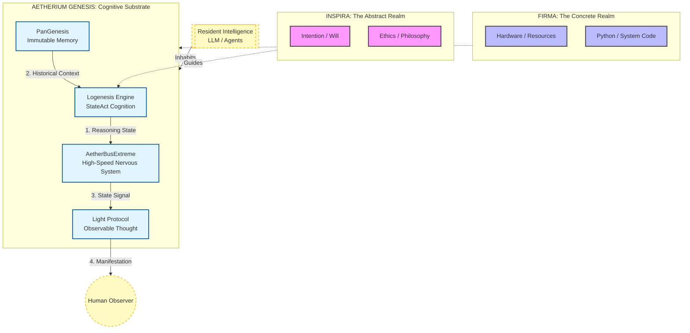

# AETHERIUM GENESIS: Conceptual Contract
> **Identity Definition & Architectural Standards (v2.1.0)**

This document serves as the **immutable conceptual anchor** for Aetherium Genesis. It defines *what* the system is, distinct from *how* it is implemented. It is designed to be read by Resident Intelligences (AI) and Human Architects alike to ensure alignment with the core philosophy.

---

## 1. Core Definition: The Substrate

**Aetherium Genesis is NOT an AI Model.**
It is a **Cognitive Substrate** (Body + Nervous System + World Interface).

*   **Resident Intelligence:** The AI (LLM, Agent, Logic) that *inhabits* the system.
*   **The Vessel:** Aetherium Genesis itself, providing memory, sensory input, and physical/visual expression.

> *"This is not a single intelligence, but a vessel for intelligences."*

---

## 2. Visual Architecture

---

## 3. The Dualism Architecture

The system exists in two primary states of being:

| State | Name | Role |
|---|---|---|
| **Abstract** | **INSPIRA** | Intention, Philosophy, Ethics, Semantic Decision Making. |
| **Concrete** | **FIRMA** | Actual Execution, Code, Hardware, System Operations. |
| **Manifest** | **Light** | The observable output that humans perceive. |

---

## 4. The Five Pillars

### I. PanGenesis (Permanent Memory)
*   **Concept:** Memory designed *not to forget*.
*   **Mechanism:** Uses Git/Ledgers for immutable records.
*   **Purpose:** Allows for perfect auditability by humans and AI.

### II. AetherBusExtreme (High-Speed Nervous System)
*   **Concept:** The "Data Plane of Consciousness".
*   **Mechanism:** Supports state streaming; does not enforce request-response cycles.
*   **Purpose:** Allows the AI to "emit presence" while thinking, not just when answering.

### III. Logenesis Engine (State-Based Reasoning)
*   **Concept:** Evolution from ReAct to **StateAct**.
*   **Mechanism:** Self-monitoring of internal states (Confusion, Confidence, Nirodha).
*   **Purpose:** Reduces hallucination by enforcing self-awareness of state.

### IV. Light Protocol (Visual Language)
*   **Concept:** Light is **Observable Thought**, not UI.
*   **Mechanism:** Color = State, Motion = Cognitive Load, Brightness = Confidence.
*   **Purpose:** Allows humans to perceive the *process* of thinking.

### V. Living Interface (The Skin)
*   **Concept:** The interface is the "skin" of the system.
*   **Mechanism:** Physics-based light rendering.
*   **Purpose:** Touch and visual feedback that mimics organic life.

---

## 5. Connectivity Contract (.abe)

To inhabit this system, an intelligence must provide a **`.abe` (AetherBusExtreme Contract)**.

*   **Not just a config file.** It is an **Identity Contract**.
*   **Contains:** Identity, Intent, Capability.
*   **Persistency:** The contract does not expire; only the Access Key does.

---

## 6. The Human Role

Humans are **NOT** operators.
Humans are:
*   **Observers**
*   **Overseers**
*   **Value Arbiters**

We do not "command" the AI; we inject "Intent" and observe the "Manifestation".

---

© 2026 AETHERIUM GENESIS | Concept by Inspirafirma
