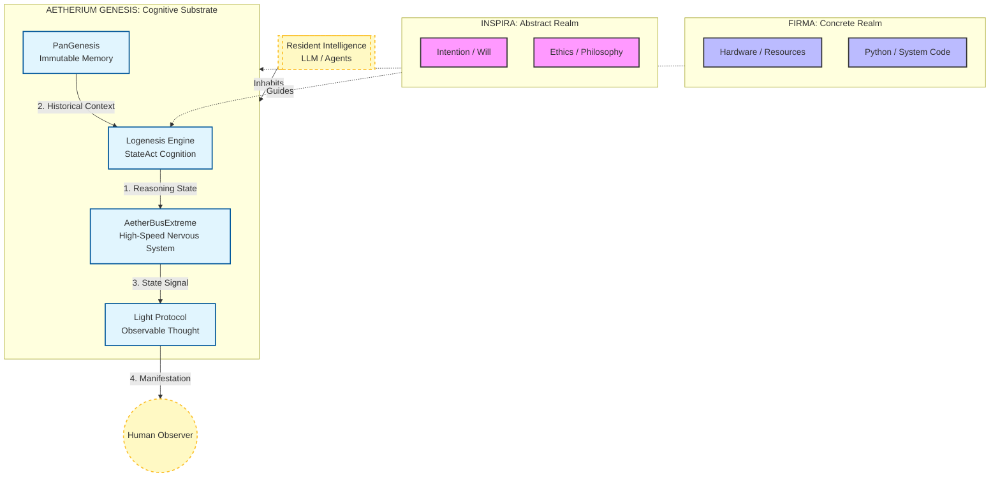

# AETHERIUM GENESIS (AG-OS)
### Cognitive Infrastructure for Synthetic Existence


> **"This is not a single intelligence, but a vessel for intelligences."**

---

## 📖 User Guide
For comprehensive installation and usage details (Desktop, Mobile, API), please see:
*   [**🇹🇭 USAGE_TH.md (Thai)**](../USAGE_TH.md)
*   [**🇬🇧 USAGE_EN.md (English)**](../USAGE_EN.md)

---

## 🌌 Introduction: What is Aetherium Genesis?

**Aetherium Genesis** is NOT designed to be:
- A Large Language Model (LLM)
- An automation tool
- A standard application

It IS designed to be a:
### **Cognitive Substrate**
A "semi-physical cognitive framework" where one or multiple AIs can **connect, inhabit, and express themselves.**

> If AI is the "Consciousness",
> Aetherium Genesis is the **Body (Nervous System + World Interface).**

---

## 🧠 Shared Understanding

We agree on the following core principles:

- Aetherium Genesis is **not tied to any single AI.**
- It can host:
  - Small Local LLMs
  - Service-based LLMs (OpenAI, Gemini, etc.)
  - Logical AIs / Specialized Agents
- These AIs are **not the center**; they are **"Resident Intelligences"**.

This system functions as:
- A logical medium
- A bio-digital brain structure
- A structure helping AI understand humans and the real world more granularly.

---

## 🏛️ Architecture: Dualism

The system is divided into 2 primary states and 1 manifestation state.



| State | Name | Role |
|---|---|---|
| Abstract | **INSPIRA** | Intention, Philosophy, Ethics, Semantic Decision Making. |
| Concrete | **FIRMA** | Actual Execution, Code, Hardware, System Operations. |
| Manifestation | **Light** | The observable output that humans perceive. |

---

## 🧬 System Pillars (Updated Core Pillars)

### 1. 🧠 PanGenesis – Permanent Memory
Memory designed **not to forget**.
Uses Git / Ledger / Immutable Records as a base.

- Records reasoning.
- Fully traceable history.
- Suitable for auditing by both humans and AI.

### 2. ⚡ AetherBusExtreme – High-Speed Nervous System
Not just an Event Bus, but the **Data Plane of Consciousness**.

- Supports State Streaming.
- Does not enforce request–response.
- Designed to let AI "emit state" while thinking.

> Humans don't just see the answer.
> They see **the process of existence.**

### 3. 🧘 Logenesis Engine – State-Based Reasoning
Evolution from ReAct → **StateAct**.

- The AI knows what state it is in.
- Self-monitoring.
- Reduces hallucination from "unconscious thinking."

### 4. 👁️ Light Protocol – Visual Language
Light is **NOT UI**.
It is **Observable Thought**.

- Color = State
- Motion = Cognitive Load
- Brightness = Confidence / Energy

### 5. 💧 Living Interface (formerly GunUI)
The interface is not buttons.
It is the "System Skin".

- Humans perceive the system affectively.
- AI expresses identity through light physics.

---

## 🔐 External Connection: .abe and AetherBus

Aetherium Genesis allows AI or other systems to connect via:

### 🔑 `.abe` (AetherBusExtreme Contract)
Not a config file, but an **Identity Contract**.

Contains:
- Identity
- Intent
- Capability

`.abe` **never expires.**

### 🔐 Access Key
- Changeable.
- Controlled by Subscription.
- Used to toggle data flow.

> Permanent Identity.
> Temporary Access.
> Control remains with the Administrator.

---

## 🧭 The Human Role

Humans are **NOT operators**.
But rather:
- Observers
- Overseers
- Value Arbiters

The system thus has:
- Public Interface (User)
- Overseer Interface (Controller)
Distinct roles.

---

## 🗺️ Evolution Plan

- Phase 1 ✅ : Genesis Core + AetherBusExtreme
- Phase 2 ⏳ : Multi-Resident Intelligence
- Phase 3 ⏳ : Symbiosis between Human–AI

---

## 📚 Documentation

*   [**CONSTITUTION**](../CONSTITUTION.md): The immutable engineering principles.
*   [**LIGHT PROTOCOL**](../LIGHT_PROTOCOL.md): Specification of light signals.
*   [**AGENTS_GUIDE.md**](../AGENTS_GUIDE.md): Instructions for AI agents working on this codebase.
*   [**CONCEPT_SHEET.md**](CONCEPT_SHEET.md): Conceptual Contract & Definition.
*   [**VASA_1_RESEARCH_SUMMARY.md**](VASA_1_RESEARCH_SUMMARY.md): Research note summarizing the VASA-1 talking-face generation paper.

---

## 🚀 Running the System

To initialize the infrastructure:

```bash
# Export python path
export PYTHONPATH=$PYTHONPATH:.

# Start the Cognitive Core (Backend)
python -m uvicorn src.backend.main:app --port 8000
```

---

© 2026 AETHERIUM GENESIS
Concept & Architecture by Inspirafirma
